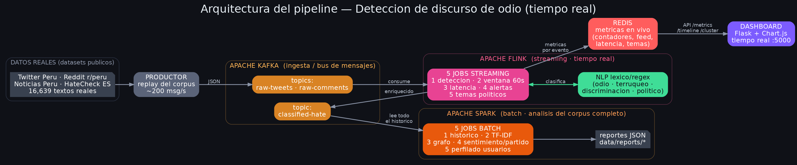
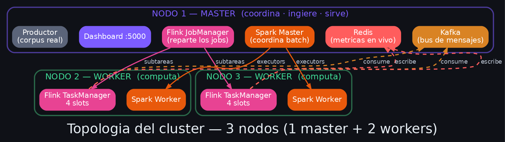
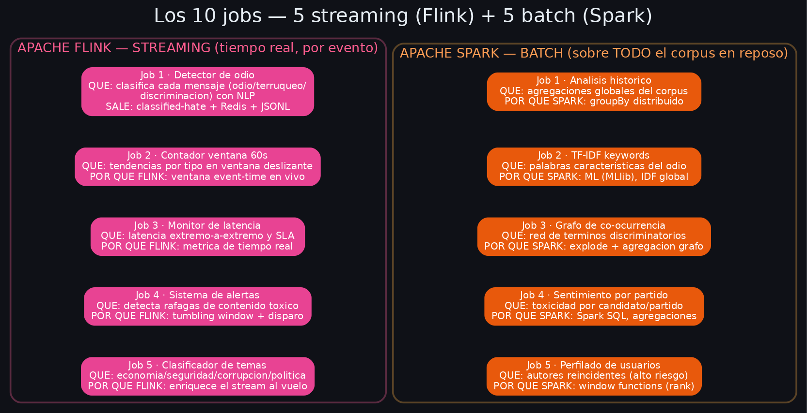

# Arquitectura del sistema (diagramas)

Detección y análisis en tiempo real de discurso discriminatorio y polarización política
en el contexto electoral peruano. Stack: **Kafka → Flink → Spark → Redis → Dashboard**.

---

## 1. Pipeline completo

| Componente | Rol |
|---|---|
| **Datasets reales** | 16,639 textos de Twitter Perú, Reddit (r/peru, r/PeruPolitica), noticias y HateCheck-ES. |
| **Productor** | Reproduce el corpus real hacia Kafka (~200 msg/s, caudal variable). |
| **Apache Kafka** | Bus de mensajes / ingesta. Topics: `raw-tweets`, `raw-comments` (entrada) y `classified-hate` (enriquecido). |
| **Apache Flink** | Procesamiento **streaming** (tiempo real). Aplica el **NLP** léxico/regex y clasifica cada mensaje. |
| **Redis** | Almacén de métricas en vivo que consume el dashboard (contadores, feed, latencia, temas). |
| **Apache Spark** | Procesamiento **batch** sobre todo el corpus acumulado → reportes JSON. |
| **Dashboard** | Flask + Chart.js, interactivo, en `:5000`. Lee las métricas de Redis. |

**Flujo:** datasets → productor → Kafka → **Flink (streaming)** → Redis (métricas) + `classified-hate` →
**Spark (batch)** → reportes; el dashboard lee Redis y muestra todo en vivo.

---

## 2. Topología del cluster — 3 nodos (1 master + 2 workers)

- **Nodo 1 — MASTER (coordina · ingiere · sirve):** Kafka, Redis, **Flink JobManager**, **Spark Master**,
  dashboard y productor. No hace cómputo pesado: orquesta y reparte el trabajo.
- **Nodo 2 y Nodo 3 — WORKERS (computan):** cada uno un **Flink TaskManager (4 slots)** + **Spark Worker**.

**Reparto del trabajo:** el JobManager distribuye las **subtareas** de los jobs Flink entre los 2 workers
(8 slots = 4+4); el Spark Master lanza **executors** en los 2 workers. Así el procesamiento se **divide
entre las máquinas** — es el modelo "1 master + 2 workers" exigido por el enunciado (mínimo 3 nodos).

> **Cómo se prueba:** Flink UI (`:8081`) muestra subtareas con *Host* = IPs de los 2 workers;
> Spark UI (`:8080`) muestra 2 Workers ALIVE; el panel de cluster del dashboard muestra las 3 tarjetas.

---

## 3. Los 10 jobs — 5 streaming (Flink) + 5 batch (Spark)

### Flink (streaming · tiempo real, por evento)
| # | Job | Qué hace | Por qué streaming |
|---|---|---|---|
| 1 | Detector de odio | Clasifica cada mensaje (odio/terruqueo/discriminación) con NLP | Decisión por evento, al instante |
| 2 | Contador ventana 60s | Tendencias por tipo en ventana deslizante | Ventana *event-time* en vivo |
| 3 | Monitor de latencia | Latencia extremo-a-extremo y SLA | Métrica de tiempo real |
| 4 | Sistema de alertas | Detecta ráfagas de contenido tóxico | *Tumbling window* + disparo inmediato |
| 5 | Clasificador de temas | Economía/seguridad/corrupción/política | Enriquece el stream al vuelo |

### Spark (batch · sobre TODO el corpus en reposo)
| # | Job | Qué hace | Por qué batch |
|---|---|---|---|
| 1 | Análisis histórico | Agregaciones globales del corpus | `groupBy` distribuido sobre todo el dataset |
| 2 | TF-IDF keywords | Palabras características del odio | ML (MLlib); el IDF necesita el corpus completo |
| 3 | Grafo de co-ocurrencia | Red de términos discriminatorios | `explode` + agregación tipo grafo global |
| 4 | Sentimiento por partido | Toxicidad por candidato/partido | Spark SQL, múltiples agregaciones |
| 5 | Perfilado de usuarios | Autores reincidentes (alto riesgo) | *window functions* (rank) sobre todo el historial |

> **Streaming vs batch:** Flink responde **al instante** (el pulso en vivo); Spark hace el **análisis
> profundo** que necesita todo el corpus a la vez (la "autopsia"). Cada job demuestra una capacidad
> técnica distinta, como exige el rubro.
